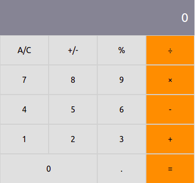

# Math Magicians

> This project is a Single Page App that allows users to make simple calculations and read a random math-related quote. This is built with React.

## Built With

- HTML
- CSS
- Javascript
- React
- Bootstrap

## Live Demo

[Heroku](https://math-magicians-nacho.herokuapp.com/)
[Netlify](https://compassionate-pike-d93428.netlify.app/)

## Getting Started

To get a local copy up and running follow these simple example steps:
- Clone the repo to your computer.
In the project root folder: 
- Run "npm install" to install all the dependencies.
- Run "npm start" to see it working on your browser.

👤 **Nacho Sala**

- GitHub: [@nachosala89](https://github.com/nachosala89)
- Twitter: [@nachosala89](https://twitter.com/nachosala89)
- LinkedIn: [Juan Ignacio Sala](https://www.linkedin.com/in/juan-ignacio-sala)

## 🤝 Contributing

Contributions, issues, and feature requests are welcome!

Feel free to check the [issues page](../../issues/).

## Show your support

Give a ⭐️ if you like this project!

## 📝 License

This project is [MIT](./MIT.md) licensed.
